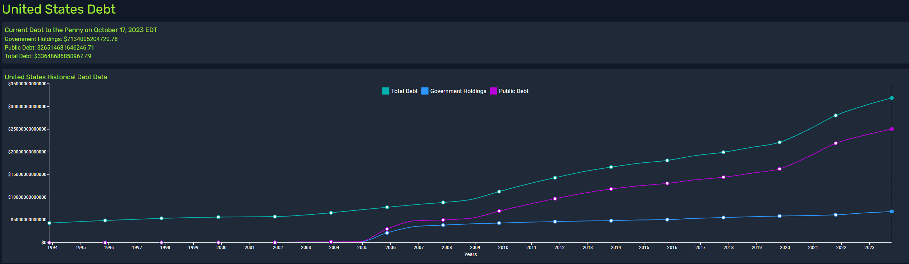

# US Debt Information App

A small React app that displays a chart showing historical data of the United States debt from 1993 to the present.

All data is retrieved from TreasuryDirect's [Debt Information Web API](https://treasurydirect.gov/legal-information/developers/web-api-debt/).

TODO:

- Download data within date range as a .csv file.
- Add basic & Keynesian mathematical models for simulating the US debt.

